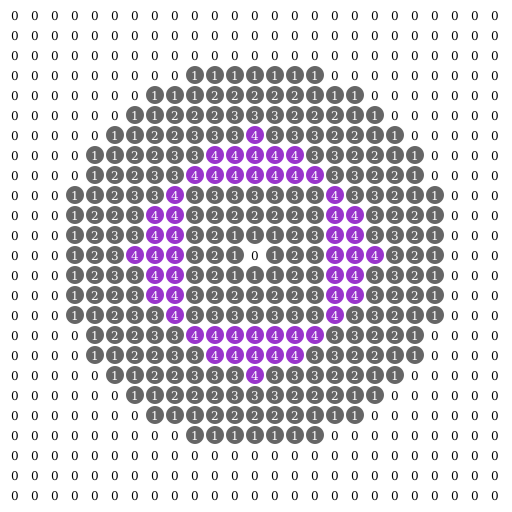

Derctuo†: a self-contained repository of 20 megabytes of reproducible explorable explanations as a sequel to Dercuano
=====================================================================================================================

[Dercuano]: http://canonical.org/~kragen/dercuano

I collected [Dercuano] last year, 02019 CE, and wrote some of it; but
I wrote most of it over the 14 years leading up to 02019.  Many of
my ambitions for Dercuano were not realized: I wanted it to be not
merely a hypertext but also a repository of highly reproducible and
observable computational experiments, with the hypertext aspect being
merely one aspect of the system’s total capabilities.  However, I
worried that perfectionism on this axis could prevent its publication
as a self-contained repository in practice.
So the calculations and system models in
Dercuano were mere dead text — I ran the calculations in Python, or in
units(1), or in JS, or whatever, then copied and pasted the results
into notes in Dercuano.  And the little code I did write for Dercuano
itself, I mostly wrote in Python and ran from the Makefile.  And I
exploited browser facilities extensively for things like diagrams and
tables of contents — a decision that came back to bite me when I
hacked together a PDF version in the last few days of 02019.

So what’s my vision for Derctuo?  How would I like it to be similar or
different?

[Hamming said](https://www.cs.virginia.edu/~robins/YouAndYourResearch.html):

> And I suggest that by altering the problem, by looking at the thing
> differently, you can make a great deal of difference in your final
> productivity because you can either do it in such a fashion that
> people can indeed build on what you've done, or you can do it in
> such a fashion that the next person has to essentially duplicate
> again what you've done. It isn't just a matter of the job, it's the
> way you write the report, the way you write the paper, the whole
> attitude.

There are a number of ways in which Dercuano is more like “do it in
such a fashion that the next person has to essentially duplicate again
what you’ve done”.  The context of Hamming’s remark is generalizing
mathematical methods, and that is one way Dercuano is limited in
scope, but 

†Clearly the sequels to Dercuano should be called Derctuo, Derczrio,
Dercforro, and so on.

Derctuo is a self-contained repository
--------------------------------------

A *sine qua non* for both Dercuano and Derctuo is archivability: it
must be possible to continue to use them after this body dies, even
many years later.  This means that it must be possible, even easy, to
save a local copy of them on stable storage, and that this copy must
continue to work and be replicable, even if whatever servers I have
set up are lost in time, like tears in rain.

The “repository” I refer to here is not necessarily a Git repository;
it need not include the full change history, and moreover it needs to
be interpretable with a minimum of previous knowledge in order to
maximize reproducibility.  So probably we’re talking about something
like a tar file or uncompressed zip file.

This is easy enough to do without restrictions if I’m willing to
include dependencies on arbitrarily complex assemblages of software,
such as modern Linux, Python 3, and so on.  But my experience with
things like that is that it’s often hard to characterize the
dependencies of such software, and consequently it tends to “bitrot”
at a rate around one new bug per 10000 lines of code per year.  The
Python 2 code I initially wrote for Dercuano required a number of
fixes to run successfully even in Python 3, and that was only about a
thousand lines of code.  If you want to run a codebase of a million
lines of code that hasn't been maintained in 20 years ago, you will
probably need to find and fix thousands of bugs.

of highly reproducible
----------------------

This brings us to the question of reproducibility.  In order for
Derctuo to be of any value to the future, it must be possible to
interpret it in some fashion.  Moreover, the results it describes
ought to be reproducible in the sense that an ordinary calculation or
physics experiment is reproducible: anyone ought to be able to follow
the procedures, or have a computer follow them, in order to get the
same results.

To achieve this, Derctuo must have as narrow as possible an interface
to its host system, to keep bitrot to a minimum; and that interface
must be completely defined in a human-readable form, so that, even
after bitrot has happened, it is possible to recover from it.  So its
codebase must be written in a very different fashion from ordinary
codebases.  It's something more like a demoscene diskmag than a modern
software development project.

explorable explanations
-----------------------

[explanation of A\*]: https://www.redblobgames.com/pathfinding/a-star/introduction.html

Shortly after I finished Dercuano, I wrote [an SDF-based
skeletonization experiment][2] based on some font-rendering problems
I’d had in Dercuano.  It contains a linear-time skeletonization
algorithm, implemented in JS, which you can exercise by editing the
bitmap that forms its input; from the best explorable explanations
I’ve seen, I copied the idea of displaying the output in the same
place as the input.  (Amit Patel’s [explanation of A\*] is a paragon
of this technique.)

This is the kind of thing I want in Derctuo.  I’d like to go further,
though, and display the code for the algorithm as well, allowing the
user to edit it as they please — not just a fixed, limited set of
knobs, but the full flexibility I enjoyed as I wrote the page in the
first place, including the flexibility to change the algorithm
arbitrarily.

[2]: http://canonical.org/~kragen/sw/dev3/circlegrid

within a download budget of 20 megabytes
----------------------------------------

Twatter’s home page currently takes 425 KB for me to load, plus about
another 10 KB or so per second.  Google’s home page is 35.5 KB.
Fecebutt's home page is 96.6 KB.  A 64 kbps phone conversation is
480 KB per minute, similar to keeping Twatter open.  YouTube’s home
page is 5.1 MB, but there’s currently [a popular video on there of J
Balvin performing a song called Rojo] on there for 4 minutes and 46
seconds which has 97 million views.  At its lowest resolution, it’s
640×360 pixels, and takes 13 MB to watch, about 2.7 MB per minute.
The full-resolution version, which presumably some people watch, is
349 MB, 73 MB per minute.

For Dercuano, I decided on a 5 MB download budget, and the final
Dercuano tarball was 3.56 MB, about the same as holding Twatter open
for a five-minute phone call.  The PDF rendering was instead 17.2 MB,
although probably a factor of three in that is due to me hacking the
PDF renderer together over the course of a few days without
understanding the PDF format or the ReportLab library very well.

[a popular video on there of J Balvin performing a song called Rojo]: https://youtu.be/_tG70FWd1Ds

This tight download budget makes it fairly easy to download copies of
Dercuano, and reduces the temptation to delete them to save space; and
I was able to upload the PDF to Library Genesis, among other places,
without any difficulty.  But I think it was too constraining: of my
135 megabytes of photographs of my ceramics experiments, for example,
I included **zero**.  So for Derctuo I am expanding it to 20
megabytes, which evidently is only a few seconds of download time for
many people today.

With a 3:1 compression ratio, which is probably feasible, this is
enough space for about ten million words, about eight times the size
of Dercuano.

including the most important algorithms and information
-------------------------------------------------------

The objective of making Derctuo highly reproducible by eliminating as
many external dependencies as is practical requires that it must
itself include whatever algorithms it employs.  For example, if I want
to include photographic images encoded as JPEG, I need to include a
JPEG decoder in Derctuo, at least for the subset of JPEG that Derctuo
uses, and this requires an implementation of the discrete cosine
transform, among other things — and that is clearly an extremely
valuable thing to have an explorable explanation of!  And to
decompress text using the Burrows-Wheeler transform, Derctuo would
need to include an implementation of the BWT.

Similarly, when I make calculations based on physical units,
reproducing those calculations requires the definitions of those
units.  GNU units ships with a wonderful database of unit definitions
meticulously compiled by Adrian Mariano, and parsing that database
requires some kind of parsing algorithm.

as well as some of my own explorations
--------------------------------------

However, the main thing that motivates me to write up Derctuo is not
the presentation of existing, well-known algorithms and data, but the
computational exploration of topics I think are interesting, whether
aesthetically, intellectually, or practically.

but not all of Derctuo is written by me
---------------------------------------

Dercuano, as described in its Code of Conduct, is very nearly entirely
my own work.  Derctuo will include important data and code from many
other sources, as long as that doesn’t pose a legal threat to its
preservation.  For example, I think it should be possible to include a
lot of AGPL and GPL code in it, such as the units database mentioned
above, as well as CC-BY-SA data, like most of Wikipedia.

I’m still not particularly inclined to seek out contributions for
Derctuo from other humans, because that seems like it would probably
involve a lot of negotiation.  Derctuo will be licensed under a
free-software license that ensures that other humans face no obstacles
to adding their own ideas to their copies of it and sharing them.
