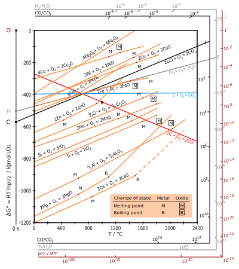

I was reading about [cold plasmas] after learning about [rosining
chips](rosining-chip.md).  They're already used in many applications
(1 ppm ionization is becoming commonly used for sterilizing in
medicine, for example) but I was thinking about a few more, including
a possible low-temperature mostly electrolytic route to rutile
reduction that doesn't have the low cathode efficiency problems that
plague traditional molten-salt electrolysis.

[cold plasmas]: https://en.wikipedia.org/wiki/Nonthermal_plasma

Ionized air oxidation
---------------------

I'm pretty sure a cold plasma of air can eat epoxy, and I suspect that
a cold plasma of just oxygen could do so.  Ozone is mostly known to
attack olefin double bonds, which by itself would not be sufficient to
eat epoxy, but I suspect ozone and the other reactive oxygen species
in the cold oxygen plasma would be sufficient.

Ionizing air generates oxides of nitrogen, which tend to not only
oxidize things (more aggressively even than ozone) but also to nitrate
them.  I suspect this would be fine for decapping chips; aluminum,
silicon, and copper are all relatively inert to such materials.
However, at temperatures below 100°, zirconia may be vulnerable, and
perhaps thus also hafnia.  Typical arcs in electric arc furnaces can
reach a few hundred ppm of oxides of nitrogen, and rarely go below a
few tens of ppm.  This suggests that to produce the ten grams or so
needed to decap a chip you'd need to run tens of kg of air through
your plasma pencil, most of which of course won't react, so you'd
probably need tonnes.  This seems slow but perhaps a feasible
approach.

(Of course if you have a drop of water on the object, that will
facilitate the attack of oxides of nitrogen on many materials,
including copper, zirconia, and hafnia; though, perhaps, at first,
before the water has absorbed much of the gas, it might have a
protective effect instead.)

I've written before about using an air cold plasma with simply a glow
discharge for selective functionalization, for example for selective
electroless metal plating or selective wetting of otherwise
nonreactive surfaces.

A cold plasma of steam would be easier to produce than that of oxygen,
and it would have a similar oxidizing effect on some materials.
However, I think the hydrogen ions would prevent other materials, such
as many metals, from oxidizing.  This could be used in some cases for
more selective oxidation.

Ionized hydrogen reduction
--------------------------

A potentially more interesting application of cold plasmas is
reduction with *just* hydrogen.  It's been routine since at least WWII
to anneal the iron powder in hydrogen before using it in powder
metallurgy, to reduce the oxide film from its surface and enable it to
cold-weld and sinter.  Surely a similar effect can be achieved with a
cold hydrogen plasma.

For example, you could pack a powder bed with a powder of an iron
oxide, infuse it with hydrogen at above 100° to drive out all the air,
insert an iron electrode into it, and apply a high-frequency high
voltage to the electrode.  This would produce a hydrogen plasma in
contact with some of the powder, and some of the iron oxide would be
reduced, producing steam, which would diffuse away from the electrode
and be replaced by fresh hydrogen to continue the process.  The iron
electrode would thus gradually grow dendritically through the oxide
powder, though not converting all of it.  Some flow of hydrogen would
be useful to flush out the steam and prevent it from re-oxidizing the
iron; alternatively some kind of desiccant such as calcined alabaster
could sequester the water, or a more easily oxidized metal could
reduce it.  

[
 <i>Ellingham diagram by Wikipedia user DerSilberspiegel, CC-BY-SA 4.0</i>
](https://en.wikipedia.org/wiki/File:Ellingham_Richardson-diagram_english.svg)

Looking at an [Ellingham diagram with hydrogen to steam ratios][0], it
seems that for hydrogen reduction of magnetite to hematite, the
equilibrium favors reduction as long as there is less than about ten
thousand parts of steam to one part of hydrogen, almost independent of
temperature over the usual ranges; and for hydrogen reduction of iron
oxide to iron, about 10× as much hydrogen as steam is needed, again
almost independent of temperature.  Unless I'm reading this diagram
wrong.

[0]: https://doitpoms.admin.cam.ac.uk/tlplib/ellingham_diagrams/printall.php

Copper, cobalt, and nickel seem similarly simple.  Other metals are a
bit less so; zinc seems to require a bit more hydrogen than water, and
that only at 1100°.  Getting down to below zinc's melting point
requires a million-to-one hydrogen-to-steam ratio, and getting down
below 200° requires a trillion to one.  At silicon's melting point of
1460° we should be able to reduce it with hydrogen at ten thousand
times the concentration of steam, and at a trillion to one this
reduces to a balmy 600°.  Rutile at its melting point above 2300° can
be reduced with hydrogen at about 3000 times the concentration of
steam, but at a more comfortable 1000° it's a billion to one, and at a
trillion to one we're down to about 600°, a bit higher than silex.
(Damned Tuftean plots with no grid lines.)  Even at these
trillion-to-one levels, sapphire doesn't yield to hydrogen's
persuasion until past 800°, magnesia alba until 1000°, and lime until
1200°.

(Maybe in some cases you'd get the hydride of the metal rather than
the metal itself.)

Actually, lime is particularly interesting in this connection because,
as in the Pidgeon process, it can combine with silex into the stabler
larnite.  This reaction can work as a sort of desiccant, in effect
allowing metallic silicon (or ferrosilicon) to reduce most metals,
even very active ones like magnesium, again as in the Pidgeon process.
Facilitating this reaction with ionized hydrogen rather than hellish
temperatures seems potentially useful.

Ferrosilicon is normally obtained by carbothermal reduction.  I wonder
if you could go further, passing a cold plasma of hydrogen
contaminated with steam over carbon at some more everyday temperature,
to increase its hydrogen-steam ratio before passing it over the metal
powder again?  You could use the carbon itself as an electrode to
ionize the water.

A more quotidian approach to removing water would be to cool the
hydrogen–steam mixture, pass it over a garden-variety low-temperature
desiccant such as alabaster, muriate of lime, or quicklime, and then
heat it up again to the reaction temperature before reionizing it.
Carrying out the cooling and heating steps with countercurrent heat
exchangers or regenerators would eliminate their unnecessary energy
consumption.

In such a case, where does the energy come from?  We apparently have
hydrogen circulating in a closed loop at constant pressure to reduce
an oxide, say silex or rutile, to its base metal, which entails adding
energy to it — if we burn the metal we will get the energy back.  The
desiccants are losing energy by being hydrated, but not nearly enough
to reduce the metals.  The mystery is solved, though, when we observe
that we must continually add hydrogen to the system if we are to
prevent its pressure from dropping.  The energy to reduce the metals
was the chemical potential energy in the hydrogen.

In the case of the desiccants, one is left to wonder what to make the
heat exchangers out of if the reaction gas is corrosive at only 800°
to even sapphire and tends to oxidize metals.  Zirconia, perhaps, or
some kind of highly refractory carbide or nitride: BN, TiN, WC, HfC,
the usual suspects.  Or maybe just aluminum, if it's countercurrent:
pipes with enough water vapor will be lined with amorphous sapphire
the way aluminum normally is, while pipes without will eventually just
be bare aluminum, but neither will corrode.  Other metals that form
similar passivation coatings serve just as well at higher temperatures
that aluminum can't handle.

So, as an example, maybe you can reduce a packed bed of powdered
rutile at, say, 800°, in a hydrogen atmosphere at atmospheric
pressure, by applying a high-frequency electrical charge through an
electrode to ionize the hydrogen, while maintaining the hydrogen very
dry (better than 100 billion to one ratio to the water) by passing it
through a desiccant such as alabaster at a lower temperature such as
room temperature, say 20°, with a countercurrent heat exchanger in
between the rutile chamber and the alabaster chamber to maintain them
efficiently at different temperatures, plus some additional heating to
maintain the rutile at its high temperature and some additional
heatsinking to maintain the desiccant at its low temperature, while
continually adding new hydrogen to the system to replace the hydrogen
absorbed as water in the desiccant.  The energy to reduce the rutile
comes principally from the hydrogen, whether that is produced by
electrolysis or, for example, from natural gas.

Hmm, shit, *that* desiccant probably can't get the hydrogen *that*
dry.  So you probably need a somewhat higher temperature.  Or maybe if
you cool the desiccant more, or use a more aggressive desiccant, you
can get down to those levels.  Obvious candidates include sodium (as
in the Hunter process), calcium (as in the Kroll process),
ferrosilicon with lime (as in the Pidgeon process), and of course
lithium, magnesium, or aluminum.

*Solid* magnesium and aluminum have the annoying problem of forming an
adherent solid oxide film when oxidized, preventing them from reducing
any further water; as outlined in Petrovic and Thomas's 2008 "Reaction
of Aluminum with Water to Produce Hydrogen: A Study of Issues Related
to the Use of Aluminum for On-Board Vehicular Hydrogen Storage",
approaches to solving this problem for aluminum include "hydroxide
promoters such as NaOH, oxide promoters such as Al₂O₃, and salt
promoters such as NaCl", but I think all of those are necessarily in
aqueous solution, and would thus produce too much contaminating steam
of their own.  Other approaches might include maintaining the
desiccant metal *molten*, with a layer of flux salts on top to keep
the oxides molten, and bubbling the gas through it to deoxidize
it. Magnesium melts at 650°, aluminum at 660°, their eutectic of about
65% aluminum at a pleasant 437°, but as explained above, even at these
temperatures, not much oxygen will escape to reoxidize the hydrogen.
Alternatively, you could disrupt the oxide layer with plasma, perhaps
using the very same hydrogen gas or perhaps using a more conventional
sputtering gas like argon, which would of course then be mixed in with
the hydrogen.

In this form, you're essentially performing an aluminothermic (or
magnesiothermic) reduction of rutile, but with hydrogen acting as a
catalyst (instead of, as previously, a fuel.)

Higher pressures would tend to increase the reaction rate, but I don't
think they'll affect the equilibrium much, because both hydrogen and
steam are gaseous, with the same number of moles as the resulting
water.  If you instead used a reducing gas with a different number of
hydrogens, such as methane, ammonia, maybe hydrazine if it can stand
the heat (silane can't), nitric oxide, or even plain nitrogen, you
might be able to use pressure to shift the equilibrium.  This might
allow you to tolerate a larger percentage of water vapor in the system
before the metal stopped reducing.

Zircon, zirconia, coltan, and molybdenite could likely be reduced in
the same way.

Flue gas decontamination
------------------------

If you have an unlimited supply of sufficiently dry hydrogen, the
unused hydrogen contaminated with steam could be disposed of by simply
passing it through a flame.  Ozone and oxides of nitrogen are perhaps
not as easy, though natron water should serve to some degree, and
automotive catalytic converters are a common solution to precisely
this problem.  Olefins such as ethylene, propylene, or hexene would
probably also eliminate ozone and oxides of nitrogen, and could then
be burned with impunity.  2-methyl-2-butene is used in such a way as a
free radical scavenger.

Diesel engines commonly spray urea water ("diesel exhaust fluid" or
"AdBlue" or "Azul 32") into the exhaust to eliminate nitrogen oxides
instead of using a catalytic converter.  This also eliminates ozone.
Urea is nontoxic and quite cheap; the solution is sold by the
ten-liter bottle.  The final resulting gas mix still contains nitrogen
dioxide, though.
