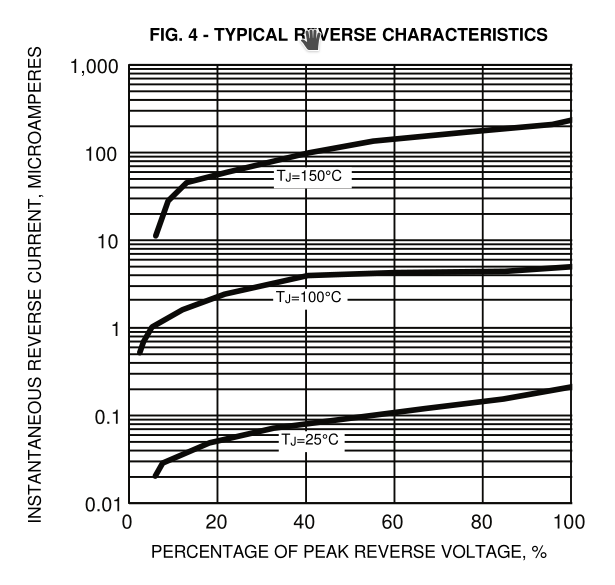
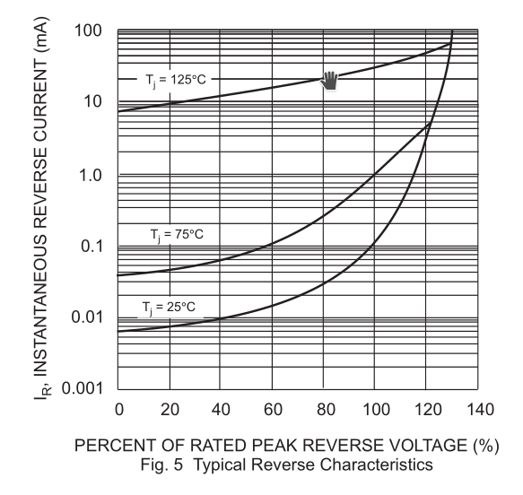

It seems like, of everyday electronic phenomena, one of those with the
largest variation by temperature is the reverse leakage in
semiconductor diodes.  As explained in [the note on
thermistors](thermistors.md), the resistivity of copper's changes by
about 3900 ppm/K, which is the basis of low-temperature "resistance
temperature detectors", and tungsten's by about 4500 (though not
consistently; it has phase changes).  Carbon film resistors have a
usually negative poorly controlled temperature coefficient of
resistance; Panasonic, for example, spec their ERDS1, ERDS2, and
ERDS25 carbon-film resistors at -150–-1000 ppm/K.

[1]: http://users.ece.utexas.edu/~valvano/Volume1/CarbonFilmresistors.pdf

NP0/C0G ceramic capacitors are specified to change their capacitance
by under 1% over their temperature range and by under 30 ppm/K, while
film capacitors are typically ±200–650 ppm/K, depending on material
and humidity.  (Thermocouples can in theory be arbitrarily precise but
they measure a temperature *difference*, and they tend to drift.)  

But feast your eyes on this plot of reverse leakage from General
Semiconductor's datasheet for 1N4001/4/7 diodes:

Over the 125° temperature range plotted here, they're claiming the
diode's reverse leakage varies by a factor of 500–1500, depending on
the voltage.  That's about *5–6% per degree*, or to put it another
way, 55**000** ppm/K.

So if you can measure the current of the diode to within 1% while
maintaining it at a relatively constant voltage, you can measure its
temperature to within 200 mK.  And some other diodes are even
*better*!  Sunmate's datasheet for their 1N5823 Schottkys, for
example, *also* claims a typical reverse current ranging over three
orders of magnitude, but over only 100°, amounting to over 7% of
current variation per degree, and furthermore at low reverse voltages
and more reasonable currents:

This diode is rated for 1500 pF typical capacitance at near-zero
voltage, but a milliamp amounts to about 0.7 V/μs at that capacitance,
so you'd need to be pretty quick to measure it discharging its own
junction capacitance — you'd probably want to use some external
capacitance, which might be at a different temperature.

Because the dependence of these effects on voltage is fairly weak, you
ought to be able to get a fairly reproducible discharge rate even in
the face of some voltage variation.

The other temperature-measurement candidates that come to mind are LED
reverse leakage, ferroelectric-capacitor dielectric permittivity, and
quartz crystal resonant frequency, this last not because it varies a
lot but because it can be measured to greater precision.  Most
crystals, though, are cut to have their extremum in resonant frequency
happen at 20° or 25°, so it's hard to measure them against each other.
