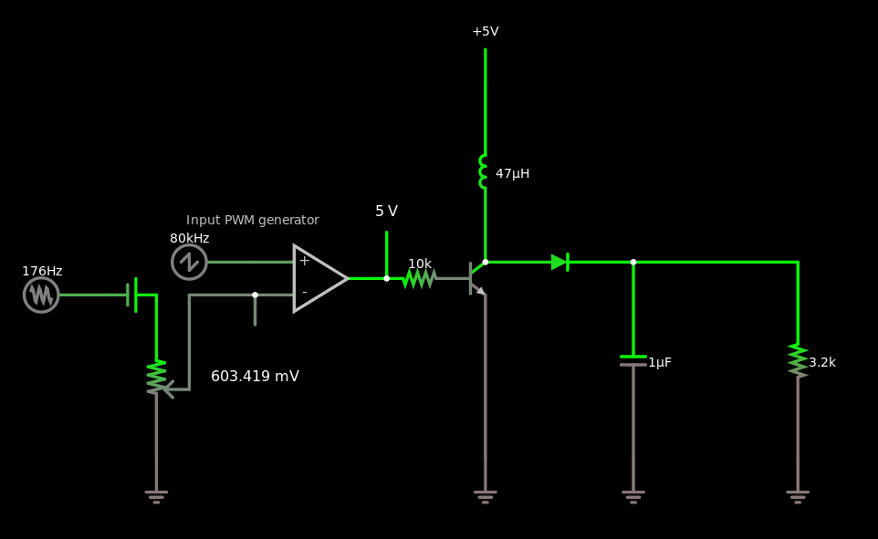

This circuit doesn’t work:

    $ 1 5e-9 5.692113234615338 60 5 43
    R 416 432 352 432 0 4 80000 2.5 2.5 0 0.5
    170 272 464 208 464 1 20 50000 2.5 0.01
    v 272 464 320 464 0 0 40 2.5 0 0 0.5
    a 416 448 544 448 9 5 0 1000000 0.6034186806095027 1.5999999949944597 100000
    O 544 448 544 384 1
    x 349 395 478 398 4 12 Input\sPWM\sgenerator
    O 416 464 416 544 1
    174 320 464 352 624 0 1000 0.8762000000000001 Input attenuator
    g 320 624 320 656 0
    w 352 544 352 464 0
    w 352 464 416 464 0
    t 608 448 640 448 0 1 -3.5804133275459917 0.692890403465214 100
    w 640 464 640 624 0
    g 640 624 640 656 0
    l 640 432 640 256 0 0.000047 -0.04307177750648704
    r 608 448 544 448 0 10000
    R 640 256 640 208 0 0 40 5 0 0 0.5
    c 784 432 784 624 0 0.000001 6.171399381253317
    g 784 624 784 656 0
    w 784 432 944 432 0
    r 944 432 944 624 0 3200
    g 944 624 944 656 0
    d 640 432 784 432 2 1N5711
    o 6 1024 0 4354 8.183476519740355 9.765625000000001e-155 0 1 input\sv
    o 20 1024 0 4099 10 0.8 0 2 20 3

The first problem is that this isn't a buck converter as intended;
it's a boost converter!

Here the 3200Ω resistor represents an 8Ω speaker seen through a 20:1
audio output transformer.  You put an AC volt across it, you get 310
μA, which on the output is supposed to be 50 millivolts and 6.2 mA,
which is 8Ω.  The quadratic way transformers transform impedances
always confuses me!

The input comparator generates a PWM signal that shorts the coil-diode
junction to ground periodically through an NPN transistor.  (Probably
using a MOSFET would be a better idea.)  The idea is that when the
coil is shorted to ground, it builds up energy in the form of a
magnetic field with a progressively growing current, and then when the
transistor turns off, that energy is delivered to the load, with the
current progressively dropping until the next cycle.  At the extreme
where the transistor is always off, the 5V power supply is simply
connected through to the output through a diode and an inductor.  At
the extreme where the transistor is always on, the current through the
coil and the transistor will progressively increase until the
transistor burns out.

Near that extreme, there is a short time when the transistor turns
off, and the enormous current through the coil must flow instead to
the load, charging up the capacitor very rapidly.  This can produce,
in theory, an arbitrarily high voltage.

Managing voltages on the order of 5 volts, cycle times on the order of
10 μs, and currents on the order of 1 mA, we probably want an
inductance that produces about 5 volts with a slew rate of about 1 mA
per 10 μs.  This would be about 50 mH, three orders of magnitude
larger than the 47μH inductor I have here.  At these speeds and
impedances, this inductor looks like a wire; inductive reactance is
just ωL, so a 50 mH inductor would be 25 kΩ, while this 47μH inductor
is 24Ω, which is a wire in comparison to the 3200Ω load.

The output capacitor serves to keep the voltage from rippling too
much.  Again, in the 5V 10μs 1mA regime, we want a capacitor that is
large compared to one that would discharge completely in that time,
which would be 2 nF.  The 1μF cap I have in there will take 500 cycles
to discharge, or charge.  So probably I want something on the order of
47 nF.

Changing the components to these values does indeed make the circuit
sort of work, although it’s still a boost converter.