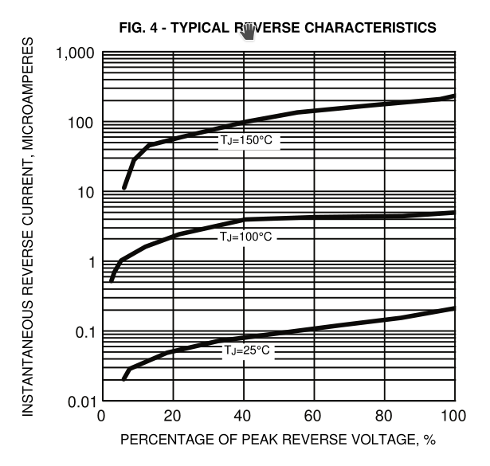
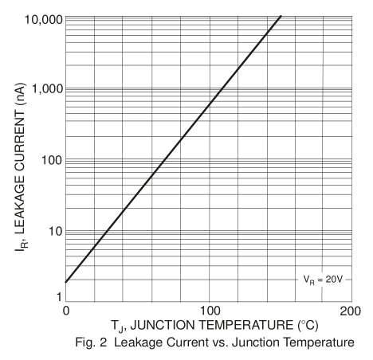
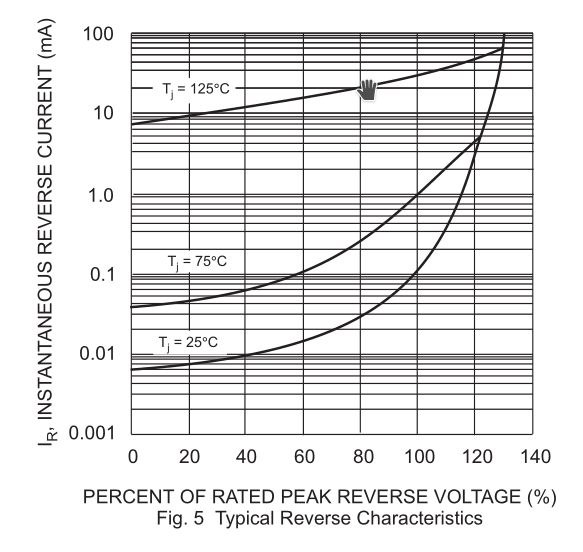
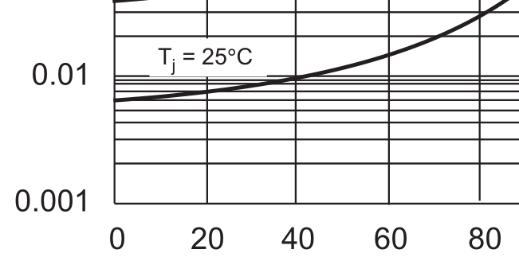

It seems like, of everyday electronic phenomena, one of those with the
largest variation by temperature is the reverse leakage in
semiconductor diodes.  As explained in [the note on
thermistors](thermistors.md), the resistivity of copper changes by
about 3900 ppm/K, which is the basis of low-temperature "resistance
temperature detectors", and tungsten's by about 4500 (though not
consistently; it has phase changes).  Carbon film resistors have a
usually negative poorly controlled temperature coefficient of
resistance; Panasonic, for example, spec their ERDS1, ERDS2, and
ERDS25 carbon-film resistors at -150–-1000 ppm/K.

[1]: http://users.ece.utexas.edu/~valvano/Volume1/CarbonFilmresistors.pdf

NP0/C0G ceramic capacitors are specified to change their capacitance
by under 1% over their temperature range and by under 30 ppm/K, while
film capacitors are typically ±200–650 ppm/K, depending on material
and humidity.  (Thermocouples can in theory be arbitrarily precise but
they measure a temperature *difference*, and they tend to drift.)  

But feast your eyes on *this* plot of reverse leakage from General
Semiconductor's datasheet for 1N4001/4/7 diodes:

Over the 125° temperature range plotted here, they're claiming the
diode's reverse leakage varies by a factor of 500–1500, depending on
the voltage.  That's about *5–6% per degree*, or to put it another
way, 55**000** ppm/K.

So if you can measure the current of the diode to within 1% while
maintaining it at a relatively constant voltage, you can measure its
temperature to within 200 mK.  Silicon-junction signal diodes like the
1N4148 are qualitatively similar, but the currents are about an order
of magnitude lower than the big rectum fryers; this plot from Diodes
Inc.'s 1N4148 datasheet plots leakage versus temperature at a fixed
voltage, rather than leakage versus voltage at various fixed
temperatures:

And some other diodes are even
*better*!  Sunmate's datasheet for their 1N5823 Schottkys, for
example, *also* claims a typical reverse current ranging over three
orders of magnitude, but over only 100°, amounting to over 7% of
current variation per degree, and furthermore at low reverse voltages
and more reasonable currents:

This diode is rated for 1500 pF typical capacitance at near-zero
voltage, but a milliamp amounts to about 0.7 V/μs at that capacitance,
so you'd need to be pretty quick to measure it discharging its own
junction capacitance — you'd probably want to use some external
capacitance, which might be at a different temperature.

By putting several such diodes in parallel you can increase the
leakage current, which will help to make it easier to measure, and
perhaps also average out some variation among them.

Crystals
--------

Typical ADCs can't digitize a current, just a voltage, and the voltage
is subject to a typically fairly large reference-voltage error (see
[Multimeter Metrology](multimeter-metrology.md) for lots on the
difficulties of measuring voltages).  To measure a current, you have
to somehow convert it to a voltage.  One way is to use a precise
capacitor and measure the voltage change over time.  But then you need
to measure time.

With an ordinary crystal oscillator ("SPXO") you ought to be able to
measure the discharge rate with error of better than ±100 ppm over a
standard -40°–+105° temperature range, or ±10 ppm if you
temperature-compensate it.

Is that right?  [Digi-Key reports that their most-stocked crystal
oscillator is the Abracon ABS05-32.768KHZ-9-T][2], which they sell for
US$0.67–1.16, depending on quantity, from the 728,528 they have in
stock.  (Hopefully we can assume that it's a relatively typical part
due to being so popular.)  It's a surface-mount 32.768-kHz crystal,
1.6mm × 1.0mm × 0.5mm, whose error is specified as ±20 ppm at 25°, a
temperature coefficient -0.02 to -0.04 "ppm/T²" with a "turn-over
temperature" of 20°–30°, and aging of ±3 ppm in the first year if kept
at 25° ±3°.  If we assume that "ppm/T²" means ppm/K² for the squared
difference of the temperature from the turnover point, where the
frequency reaches its max, then at 10° or 40° we might have ΔT = 20K
(if the turnover temperature is, respectively, 30° or 20°), thus 400K²
and as much as 16 ppm reduction in frequency, or ±8 ppm over that
temperature range, plus the ±20 ppm initial error and the ±3 ppm aging
error, totaling ±31 ppm over that range, or ±11 ppm if we initially
calibrate it.  Of this ±11 ppm error, the thermal part reaches
1.6 ppm/K in the worst case at 10° or 40°, so if we can measure our
temperature to within 2° we can compensate down to ±6 ppm.  Much below
that, we start running into tricky issues of things like thermal
hysteresis.

[2]: https://www.digikey.com/en/products/detail/abracon-llc/ABS05-32-768KHZ-9-T/3508064

To look at this another way, a 1° error in measuring the crystal's
temperature for thermal compensation, a 0.7% temperature error
(7000 ppm), produces at worst a 1.6 ppm timing error in the +10°–+40°
range.

This is maybe a little better than typical, but not that much.
Another very popular crystal on Digi-Key is the [20.0000 MHz Citizen
HCM4920000000ABJT][3] (196,220 in stock) which is described as
"±30 ppm", but again that's at 25°, plus another ±50 ppm over the
-10°–+60° temperature range and ±5 ppm aging over the first year.
They don't specify the temperature coefficient, but if we figure that
the frequency curve is, like the other crystal, parabolic with
temperature with a maximum at 20°–30°, then that's up to -100 ppm at a
ΔT of 40K, so a worst-case "ppm/T²" of -0.0625 ppm/K².

[3]: https://www.digikey.com/en/products/detail/citizen-finedevice-co-ltd/HCM4920000000ABJT/284290

So I think it's reasonable to expect that we can get to ±10 ppm by
calibrating and temperature-compensating random crystals, or ±1 ppm by
calibrating and ovening them.

Current measurement error attributable to timing error and voltage error
------------------------------------------------------------------------

So, suppose the diode leakage current we're measuring varies by 7% per
degree, as the Schottky datasheet above shows it doing, and we're
timing how fast it discharges a capacitor.  Looking more closely at
Sunmate's data sheet:

We can see that on the 25° curve it's about 6 μA at 20% of rated peak
reverse voltage and about 10 μA at 40%, which is to say, it's nearly
proportional to the voltage; below that, the leakage is nearly
constant, and above, it starts to go superlinear.  So if we take our
discharge-time measurements with bias voltage near this point, errors
in our reference voltage will mostly cancel out — the reverse leakage
voltage is, locally, nearly ohmic.  But errors in our timing *won't*
cancel out.

However, remember that a 1° error in temperature is an 0.7% error
(7000 ppm), and it takes a 10% error in timing (100 000 ppm) to cause
it.  So the ±10 ppm timing error we expect, producing a ±10 ppm error
in measuring the diode current, works out to a ±0.7 ppm temperature
error, about 200 μK.  So probably even an uncompensated SPXO with
±100 ppm would only add about 2 mK of error to the temperature
measurement.

Properly characterizing the error introduced by an imprecise reference
voltage is difficult without better information than the datasheet
gives, but handwavingly I guess that a ±2% reference-voltage error
around the ohmic voltage will produce a current measurement error of
about 2% of ±2%, or ±400 ppm, producing about ±30 ppm temperature
error, or 10 millikelvins.

Other candidate temperature transducers
---------------------------------------

Are there other things that would work better than a silicon Schottky
diode?

I've already [explored four-wire resistance temperature
detectors](thermistors.md), which have the advantage that their linear
E–I relation permits measurements that precisely cancel out any
non-drifting errors in the reference voltage, but have 15× smaller
responses on an absolute scale.

The other temperature-measurement candidates that come to mind are LED
reverse leakage (though [apparently that's typically very small
and difficult to detect because the bandgap is larger][4], suggesting
that maybe germanium diodes might work better if you can find one),
ferroelectric-capacitor dielectric permittivity, and the aforementioned
quartz crystal resonant frequency itself, this last not because it
varies a lot but because it can be measured to greater precision.
Most crystals, though, are cut to have their extremum in resonant
frequency happen at 20°–30°, so it's hard to measure them against each
other, and we need to be far from the extremum to get a large effect.

[4]: https://electronics.stackexchange.com/questions/289990/reverse-saturation-currents-of-a-led