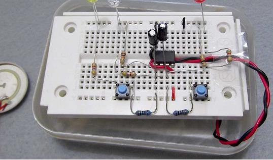
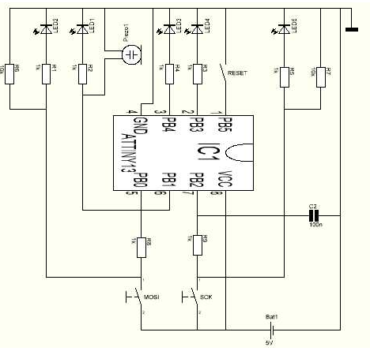
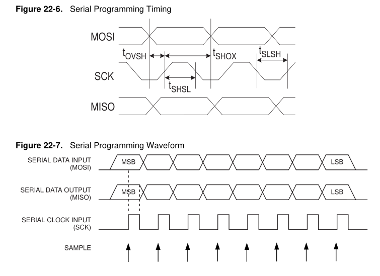

I have several microcontrollers: an Arduino Duemilanove with an
ATMega328, a couple of Blue Pills (one with an STM32 and one with a
CKS32; see [notes on STM32duino](stm32duino.md)), two or three
ATMega8s, 18 surface-mount ATTiny45s, 19 DIP ATTiny45s, two loose
ATMega328s, 16 ATTiny2313s, an Arduino Nano (or is that a Teensy?),
two Raspberry Pi Zeros, a Raspberry Pi 2 Model B 1.1 from 2014, and a
Raspberry Pi from 2012 which I think is a Pi 1 B.  66 computers in
all.

But right now the Duemilanove is the only one I have successfully
programmed!

ATTiny45
--------

[It's apparently straightforward to rig up Arduino to program an
ATTiny45](https://www.hobbytronics.co.uk/arduino-attiny); you use the
ArduinoISP sketch, wire up the ATTiny45 pin 1 (/reset) to Arduino pin
10, ATTiny45 pin 5 (MOSI) to Arduino pin 11, ATTiny45 pin 6 (MISO) to
Arduino pin 12, and ATTiny45 pin 7 (SCK) to Arduino pin 13, and of
course VCC and ground on pins 8 and 4, and then I guess
avrdude can program it.  There's an [updated Arduino support library
for Arduino 1.6](http://highlowtech.org/?p=1695) at
<https://raw.githubusercontent.com/damellis/attiny/ide-1.6.x-boards-manager/package_damellis_attiny_index.json>,
but probably just avr-gcc is fine most of the time.  And [there's an
Arduino Create Hub page about this
too](https://create.arduino.cc/projecthub/arjun/programming-attiny85-with-arduino-uno-afb829).
For ArduinoISP [you probably want to hook up a cap to stop the Arduino
from
resetting](https://arduino.stackexchange.com/questions/76815/setup-of-arduino-uno-as-arduinoisp-for-programming-attiny45).

Luna also gave me a PC with a parallel port, which might work with
avrdude without ArduinoISP.

The ATTiny45 is not super powerful and has only 8 pins, but it does
have an ADC and support multiplexing the analog comparator between
pins.

ATTiny2313
----------

The ATTiny2313 is the first AVR I programmed actually, using a
parallel port, using Limor Fried's minipov2.  It doesn't have an ADC
at all, and its analog comparator isn't multiplexable between pins,
but it has a somewhat less cripplingly small number of pins: 17 GPIOs
instead of 6, 18 if you push it.

[Arduino
support](http://arduinolearning.com/code/program-attiny2313-arduino.php)
is available at <http://drazzy.com/package_drazzy.com_index.json>.
You [hook up pin 1 (reset) to pin 10 of the Arduino, just as with the
ATTiny45](https://oscarliang.com/program-attiny2313-using-arduino/),
and similarly pins 17, 18, and 19 (DI, DO, SCK) to pins 11, 12, and 13
of the Arduino.  (I'm guessing they're "DI" and "DO" because the 2313
doesn't have SPI hardware.)  [TinyDebugSerial is supposed to make the
serial port work](http://www.ernstc.dk/arduino/2313.htm).

This last link also gives a somewhat mangled command line for using
ArduinoISP or [something called
"TinyISP"](https://github.com/Coding-Badly/TinyISP) directly from
avrdude.

>  Avrdude, when using ArduinoISP
>
>     avrdude -P COM20 -b 19200 -p t2313 -c avrisp
> 
> Upload using TinyISP
> 
>     -p attiny2313 -c stk500v1 -P COM3 -b19200 -Uflash:w:Blink.hex:i

The best documentation for avrdude [is still Limor
Fried's](http://www.ladyada.net/learn/avr/avrdude.html).

[There are a few different options for serial data on these tiny
machines
actually.](https://forum.arduino.cc/index.php/topic,123388.30.html)
This is very useful because it provides a way to debug, and also to
use these devices as sensors before having a screen to display the
results on, and also a way to use them for continuous data acquisition
or later download from EEPROM data.  And because it's reasonable to
use a crystal on it, you can meet RS-232 timing requirements!

Programming AVRs with pushbuttons
----------------------------

Heinz D. [wrote an ATTiny13 tutorial in
German](http://www.elektronik-labor.de/AVR/KursAssembler/T13asm13.html)
which starts out by attaching switches to the reset, SCK, and MOSI
lines of an ATTiny13 and programming it with them.

Here's Heinz D.'s schematic:

The ATTiny2313 datasheet has "serial programming timing" on p. 205:

This doesn't really explain how you get into serial programming mode,
or what data gets input or output, though.  It does mention the
protocol a bit on p. 29: "If the RSTDISBL fuse is programmed, this
start-up time will be increased to 14CK + 4 ms to ensure programming
mode can be entered."  So apparently you program it during reset?
Surely I'll eventually find the full procedure.