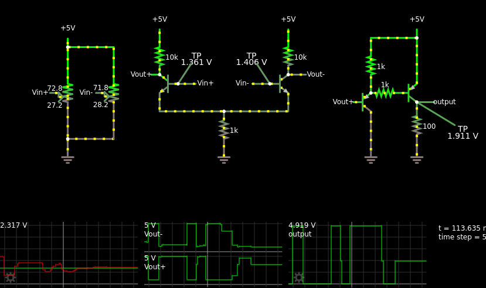

It's been Norbert Wiener's birthday today, and although he wasn't the
inventor of the op-amp, he was the key person in explaining the
significance of the op-amp and similar things.  So I thought I'd
celebrate by building my very first op-amp.  If I could.

I got a four-transistor circuit working in [Falstad's circuit
simulator](https://tinyurl.com/yyjol6yg):

    $ 1 0.000005 0.06323366621862497 50 5 50
    R 176 208 176 176 0 0 40 5 0 0 0.5
    174 176 368 176 208 1 100 0.5693 Vin+
    g 176 368 176 400 0
    207 160 288 128 288 4 Vin\p
    207 368 272 416 272 4 Vin\p
    t 368 272 336 272 0 1 0.6109572102548784 0.6310546959814354 100
    w 336 288 336 320 0
    w 336 320 448 320 0
    r 448 320 448 384 0 1000
    g 448 384 448 400 0
    r 336 256 336 192 0 10000
    R 336 192 336 160 0 0 40 5 0 0 0.5
    207 336 256 304 256 4 Vout\p
    w 176 208 256 208 0
    w 176 368 256 368 0
    174 256 368 256 208 1 100 0.2822 Vin-
    207 240 288 208 288 4 Vin-
    t 528 272 560 272 0 1 -3.588999998997953 -0.7590165014195449 100
    w 560 288 560 320 0
    w 560 320 448 320 0
    207 528 272 480 272 4 Vin-
    R 560 192 560 160 0 0 40 5 0 0 0.5
    r 560 256 560 192 0 10000
    207 560 256 608 256 4 Vout-
    207 688 304 656 304 4 Vout\p
    r 784 384 784 304 0 100
    R 784 192 784 160 0 0 40 5 0 0 0.5
    g 784 384 784 400 0
    207 784 304 832 304 4 output
    368 784 304 864 352 0 0
    r 752 288 704 288 0 1000
    t 752 288 784 288 0 -1 -0.5948957135185378 -0.6972226181259069 100
    w 784 272 784 192 0
    t 688 304 704 304 0 -1 2.190113987148148 -0.6288987134827844 100
    w 784 192 704 192 0
    r 704 192 704 288 0 1000
    g 704 320 704 400 0
    368 528 272 496 224 0 0
    368 368 272 400 224 0 0
    o 3 1 0 4098 5 0.1 0 2 20 0
    o 23 1 0 4098 5 0.1 1 2 23 3 Vout-
    o 12 1 0 4098 5 0.1 1 2 12 3 Vout\p
    o 28 1 0 4098 5 0.1 2 2 28 3

It seems to have open-loop differential gain of at least 100 and
outputs down to the negative rail ("single-supply op-amp") but it
wastes a ridiculous amount of power in its class-A output stage.  Also
it has an input offset voltage of about 50 mV and an offset current of
a couple of milliamps.  So it's not a very *good* op-amp, but it *is*
an op-amp.

I feel like it ought to be possible to get the output stage down to
one transistor instead of two, but I was having a hard time getting
that to work (my output stage was loading down the differential pair
too much) and so I just brute-forced it with a PNP emitter follower.
The emitter-follower loading is still probably the culprit for the
rather poor offset voltage.

I haven't breadboarded it yet, and I had a hard time figuring out why
the previous circuit simulation weren't working, and I'd like to see
if I can get the output stage down to one transistor.
