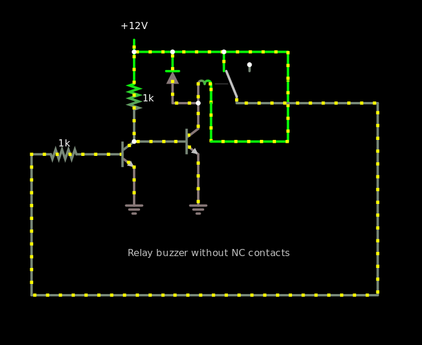

As a test of mostly breadboading, I breadboarded [this 12V relay
buzzer](http://falstad.com/circuit/circuitjs.html?ctz=CQAgjCAMB0l3BWKsyVQTgOwA4BMAWdbTXMbbCBSEJfAZgCgAlEAWn2xADZ82OQ6uKMPzUwQ6pOgIGAJz6ceC8Ji7DUcBgBdlYVQKF61YtuOkkeosNZLo7ySLixdxTzPkyRM3uiHyptNnQ1MHQhdk5QiXBkLgQ8SDo6bHo6SCxsdFjiYPwXURxIBC41VUg5IJCw030o9XgGAHNlXEhOCJBcYqgmg3BqwU7u8r1ObDFcMepx9WQJFHRi9xcnOh5Mzhgi8Hh4ByFJ8oB3ZSVqM4YTpWveGePuXiUwfEfee+fX8BeVY0u+8U4gzAXEkf34AL8kX093BtW+Rh6JxmEK6IUmiKGaM4qIEXE2fxxa3aCKJGNYCLq5P0pPKABN1OjzrwhLSAKYAMwAhgBXAA2Wj+E0BhkZgoe4ouAA82N06KEvmpBEJeOIQExWbzOQBPAA6AGcAEbcgBextZsn1RwAlloABYAe25Wn1ADkAML6gDG9oAdlpOZ6tHqGEA
"https://tinyurl.com/y35xk5ov") from a couple of random NPN
transistors and a microwave oven relay:

    $ 1 0.000005 0.010109782498721881 50 5 43
    R -48 64 -48 32 0 0 40 12 0 0 0.5
    r -48 64 -48 176 0 1000
    t -48 176 32 176 0 1 0.6207115498642259 0.6788785101220731 410
    t -96 192 -48 192 0 1 -0.02761021024479937 0.6512682998772737 760
    r -96 192 -176 192 0 1000
    g -48 208 -48 256 0
    g 32 192 32 256 0
    178 80 128 80 80 0 1 0.2 0.019618688531384095 0.05 1000000 0.02 280
    w -48 64 0 64 0
    w 64 64 64 80 0
    w 64 64 144 64 0
    w 144 64 144 176 0
    w 32 128 32 160 0
    w 48 128 48 176 0
    w 48 176 144 176 0
    w 80 128 256 128 0
    w 256 128 256 368 0
    w 256 368 -176 368 0
    w -176 192 -176 368 0
    d 0 128 0 64 2 default
    w 0 128 32 128 0
    w 0 64 64 64 0
    x -56 319 146 322 4 12 Relay\sbuzzer\swithout\sNC\scontacts

Falstad’s simulation runs the relay at 200kHz by default, much faster
than the relay I have, which is at about 100 Hz.

It was frustrating and slow to build the circuit because:

- I was making jumper wires by sanding varnish off coarse magnet wire
  with sandpaper between my fingers;
- I didn’t know the pinouts of the transistors or the values of the
  resistors (actually I think one of them may have been 1k5Ω)
- probing the breadboard with probes that don’t fit was pretty
  inconvenient;
- I broke a leg off Q2 during the process, and that took me a while to
  figure out;
- a multimeter with no audio is a slow way to check out the circuit.

However, once I had it all connected and checked out with the
multimeter, I plugged it in and it ran.  This was satisfying.
