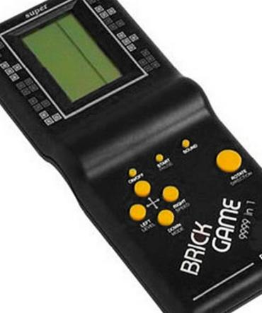
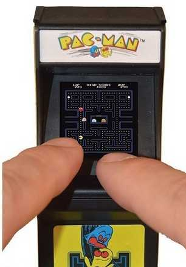

One of the things I’ve been wanting to do is to make an autonomous
personal computing device, since one doesn’t seem to be forthcoming
from the economy.  It seems likely the easiest way to do this is to
get an existing device with the right peripherals (power, input, and
output), remove its CPU and RAM, and implant a new microcontroller.

None of the photos below are mine, so I cannot release them to the
public domain; they are included for the purpose of factual
commentary, including links to their sources.

Miscellaneous
-------------

Scientific calculators seem particularly promising here, but I should
probably start with something easier, like a large four-banger.  See
[the note on screens](screens.md) for some details.

The *most* interesting possibility here is probably a cellphone, maybe
a flip phone for lower battery usage — these tend to have low-power
sunlight-readable screens, rechargeable batteries, USB connections,
usable keyboards, speakers, and microphones, as well as some radio
stuff.  Old Nokia displays in particular are SPI and so relatively
easy to connect up to (easier than directly driving an LCD), though
you suffer some display latency as a result, and they only use a
couple of microwatts.  A broken Nokia 1110 goes for AR$500 (US$4) on
MercadoLibre; a lot containing a 3200, a 9300, and a 2651 go for
AR$1600 (US$10); a lot containing eight broken cellphones from that
epoch, including two QWERTY phones, goes for AR$2000 (US$14); a broken
QWERTY Nokia Asha 303 goes for AR$900 (US$7).  (The key words on
Mercado Libre are [nokia reparar].)  But this is probably a much more
advanced project.

I also have a solar garden light that seems like an appealing
possibility, though perhaps to dissect for parts; see [Garden Light
Panel](garden-light-panel.md) for details.  I was disappointed to
learn that it’s only 40–80 mW rather than the 300 mW I was hoping for,
probably because it’s amorphous, but that’s still enough to be useful.

Toys
----

There’s a [“Lionel’s Smart Tablet infantil][0]” on MercadoLibre right
now for sale by “chiquiplanet” for AR$3000 (US$20); it has what
appears to be a large passive-matrix LCD screen that seems to be
monochrome and about 80×16 non-square pixels, and has a gaudy 46-key
ABCDEF membrane keyboard:

[0]: https://articulo.mercadolibre.com.ar/MLA-846202429-smart-tablet-infantil-precio-promocional-_JM

It runs on AA batteries and appears to have a reasonably robust
construction, although it’s not marketed for kids under 3, which makes
me wonder if it’s aimed at kids with intellectual disabilities.  It’s
250 mm × 190 mm, and looks to be about 15 mm thick, which seems like
it would be a lot of space for adding a solar panel.

For AR$3500 (US$23) there’s a toy “[bilingual Disney Cars
computer][1]” sold by El Mundo del Juguete, which looks like it maybe
has a higher resolution display and also runs on AA batteries; it has
a QWERTY keyboard and a mouse:

[1]: https://articulo.mercadolibre.com.ar/MLA-825577235-computadora-bilingue-de-cars-original-ditoys-_JM

And the old standard “[9999 in 1 brick game][2]” from 2006 or earlier
is still selling, at AR$790 (US$5), which I think is the same price I
paid in 2006:

[2]: https://articulo.mercadolibre.com.ar/MLA-763348812-tetris-portatil-brick-game-con-9999-video-juegos-clasicos-_JM

This thing has pixels on the LCD screen that are literally the Tetris
squares; I think that means it’s 10×20 pixels.  The standard
chip-on-board hardware provides you with a number of different games
(with a “difficulty” parameter to multiply out to the 9999 number)
within that context.

Kinderland sells, for US$10, [a keychain-sized clone of the Pac-Man
arcade machine][3] that runs on two AAA batteries:

[3]: https://articulo.mercadolibre.com.ar/MLA-856207550-mini-juego-retro-tiny-arcade-pac-man-376-efull-_JM

This doesn’t have much of a keyboard, but it does have lots of space
to add one, and it has what appears to be a thumb-sized backlit LCD
(20 mm square) with a resolution on the order of an NTSC TV.  The
advertisement explains several times that it’s a completely functional
replica.  Several buyers marvel at how well it works.

I don’t know what kind of electronic interface the Pac-Man LCD takes
but I imagine it’s pretty power-hungry.

A more modern version of the "brick game" is the “[GC-26 168-in-1
portable console][13]”, which is a sort of Gameboy form factor (78mm ×
117mm × 24mm) with a 2.8-inch backlit color LCD and a volume knob, for
US$12.50:

The resolution looks pretty decent, like at least 640×480; probably
it’s precisely NTSC or PAL resolution:

This has composite video output, charges over USB, includes an 800mAh
lithium battery, an 8-bit CPU, 8 megabytes containing 168 ROMs, and
probably no programmability.

There are a variety of branded variants of this device, including the
Level-UP RetroBoy (“5 hour”, “600 mAh” battery), the NogaNet Pocky,
and the Sup.  A smaller-scale version is sold for US$8 as the 351-gram
[Seisa SY-891 or SY-888A Game Player Digital Pocket System][14], with
328 games on a 2.2-inch screen:

[13]: https://articulo.mercadolibre.com.ar/MLA-797382657-consola-portatil-supreme-retro-simil-gameboy-168-juegos-gc-26-_JM
[14]: https://articulo.mercadolibre.com.ar/MLA-747359420-consola-de-juego-portatil-8bits-328-juegos-sy-891-_JM

Telephony
---------

Various kinds of telephony devices have displays, keyboards, buttons,
and sometimes radios.

For US$9.50 there’s [a caller-ID display][4] for sale:

[4]: https://articulo.mercadolibre.com.ar/MLA-609831162-identificador-cid-apto-telefonos-fijos-hasta-100-llamados-_JM

This evidently has about 20 digits of 7-segment reflective LCD plus
some specific indicators, and a compartment for two AAA batteries.

For US$19 there’s a cordless phone with a backlit LCD (which the
vendor fraudulently claims is an LED display), an [Alcatel Versatis
E100][5]:

[5]: https://www.mercadolibre.com.ar/telefono-inalambrico-alcatel-versatis-e100-negro/p/MLA7992211

This gets you a phone keypad with some menu buttons, a handset for
voice communication, a rechargeable battery (supposedly 400-mAh and
7-hour talk time) and recharging base, what looks like a 12-character
14-segment alphanumeric display, and of course the short-range
license-free radio, probably 900MHz with a 6kHz bandwidth.

Other radios
------------

Someone is selling [a Motorola one-way pager][6] for US$8 with what
looks like a 20×4 character dot-matrix character display:

[6]: https://articulo.mercadolibre.com.ar/MLA-878695319-pager-morotola-radiomensaje-_JM

I’m not sure if text pager service still exists (and neither is the
seller), but presumably this device comes with keyboard and screen
intact, and Motorola pagers were famously durable.  It probably
doesn’t have a rechargeable battery, but rather a AAA battery carrier.

There are various walkie-talkies on sale (called “handy” apparently),
like [this Baofeng BF-T12][7] for US$10 from DigitalStore:

[7]: https://articulo.mercadolibre.com.ar/MLA-828118171-handy-baofeng-radio-walkie-talkie-bft12-16ch-uhf-auricular-_JM

This is a push-to-talk walkie-talkie transmitting on 16 25-kHz
channels of the 400–470 MHz band, with a 1500-mAh USB-rechargeable
battery that claims 8-hour battery life, a two-digit 7-segment LCD,
earphone and microphone jacks and a volume knob, claiming a 6–10 km
range in the country, or 1–5 km in the city.

In the US, [using most of this band requires operator licensing][8] or
is even reserved for emergency services, although two of the channels
are FRS channels (up to 500 mW, while this radio is supposedly 2 W),
but [95% of users ignore this][9], even though they’re potentially
subject to 5-figure fines.  Also the US FCC restricts these radios to
transmitting on 12.5-MHz channels since 2013 (“narrowbanding”).  [Here
in Argentina at least some of this band is exclusively assigned to
individual licensees][10] but I’m not sure what the legal status of
the rest of the band is.

[8]: https://www.amazon.com/ask/questions/Tx16UEO8P1U0I6S/
[9]: https://www.techwholesale.com/fcclicense.html
[10]: https://www.argentina.gob.ar/noticias/banda-de-frecuencias-de-450-mhz

MP3 players
-----------

Someone’s selling what seems to be a [2GB S1 MP3 USB stick for
US$8][11]:

[11]: https://articulo.mercadolibre.com.ar/MLA-898635390-mp3-i-modo-2-gb-usado-funciona-bien-_JM

This is about the same price it went for in 2007, the last time I
bought one.  It has a reflective dot-matrix passive-matrix LCD screen
with on the order of 128×32 monochrome pixels, 2 GB of storage, an
iPod-style conductive volume control, four buttons, and a USB A female
connector to plug it in with.  If I’m right that it’s an S1 MP3, there
are a couple of open-source firmwares for them ([SourceForge][17],
[the former s1mp3.de][18], [Wladston’s former s1mp3.org][19]) that
added features, so you might be able to program it instead of
rebraining it.  But they’ve been abandoned since 2009, and the CPU is
just a 24-MHz Z80.

[17]: https://sourceforge.net/projects/s1mp3/
[18]: http://s1mp3.w1r3.de/
[19]: http://web.archive.org/web/20170718212035/http://s1mp3.org/

Someone else is selling [their SanDisk Sansa 4GB MP3 player][12] for
the more reasonable price of US$3.30; it has a MicroSD slot and a
backlit LCD that looks to be something like 320×240... and a dead
battery:

[12]: https://articulo.mercadolibre.com.ar/MLA-794481832-reproductor-mp3-sandisk-sansa-clip-zip-4-gb-500--_JM

There are also “MP4 players” that have, typically, larger backlit
color screens for viewing videos, which have apparently not been
totally replaced by cellphones; some cost US$30 or more and have
Bluetooth, FM radio transmission, and so on.

Plain screens
-------------

You can get a [used “digital picture frame”][15] for US$23, basically
a backlit 7-inch color LCD with what looks like resolution of about
640×480:

[15]: https://articulo.mercadolibre.com.ar/MLA-886881618-portarretratos-digital-philips-_JM

Presumably this sucks battery like nobody’s business and is hard to
rebrain.

Measuring instruments
---------------------

MercadoLibre has an entire category of "balanzas para valija",
suitcase scales, like [this US$3.30 specimen][16]:

[16]: https://articulo.mercadolibre.com.ar/MLA-871992554-balanza-digital-portatil-de-mano-hasta-50-kg-valija-pesca-_JM

This includes a large, easy-to-read 3-digit 7-segment LCD, three
buttons, and presumably some kind of strain gauge and battery.

There are similar displays on [digital meat thermometers][21]
(US$2.50), [digital calipers][22] (US$10), and [digital countertop
scales][23] (US$10).

[21]: https://articulo.mercadolibre.com.ar/MLA-870915952-termometro-digital-pinchacarne-liquidos-y-verduras-50-300-_JM
[22]: https://articulo.mercadolibre.com.ar/MLA-857590423-calibre-digital-de-medicion-crossmaster-fibra-de-carbono-_JM
[23]: https://articulo.mercadolibre.com.ar/MLA-815753063-balanza-digital-de-cocina-tara-1gr-5kg-7-kg-10-kg-con-pilas-_JM

Clocks and watches
------------------

One [digital alarm clock][24] sells for US$3.40 and also has an LCD
display with quite a number of 7-segment and 14-segment characters.

[24]: https://articulo.mercadolibre.com.ar/MLA-805212889-reloj-despertador-cubo-cambia-7-colores-temperatura-alarma-full-time-mania-mercadolider-platinum-importadores-_JM

And for larger digits there’s [a 45-mm-tall LCD alarm clock][25]
Planeta Zenok sells for US$6.50, with somewhat fewer digits:

[25]: https://articulo.mercadolibre.com.ar/MLA-759038721-reloj-despertador-sensor-luz-lcd-digital-alarma-temperatura-_JM

For US$2 you can get [a MegaCuper LCD calculator watch][26], though
most competitors are much more expensive:

[26]: https://articulo.mercadolibre.com.ar/MLA-870440210-reloj-pulsera-calculadora-vintage-retro-digital-clasico-_JM

Remote controls
---------------

There are lots of remote controls that include a shitty keyboard, an
infrared LED for communication, and a reflective LCD display, mostly
those for air conditioners; for example, those of the [LG split air
conditioner Akb73756210][27] (US$5), the [LG BGH Arcool Ar809 air
conditioner][28] (US$5), [the Samsung AR807 air conditioner][29]
(US$4.50), and [the Sanyo Y512f2 air conditioner][30] (US$4.50).  The
LCD displays typically have a few 7-segment or 14-segment digits or
character positions and a bunch of special-purpose indicators: fan,
snowflake, and so on.

[27]: https://articulo.mercadolibre.com.ar/MLA-785536413-control-remoto-aire-acondicionado-split-lg-akb73756210-fc-_JM
[28]: https://articulo.mercadolibre.com.ar/MLA-676496899-control-remoto-aire-acondicionado-split-lg-bgh-arcool-ar809-_JM
[29]: https://articulo.mercadolibre.com.ar/MLA-652573558-control-remoto-para-aire-acondicionado-split-samsung-_JM
[30]: https://articulo.mercadolibre.com.ar/MLA-652573901-control-remoto-para-aire-acondicionado-split-sanyo-y512f2-_JM
