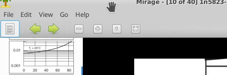
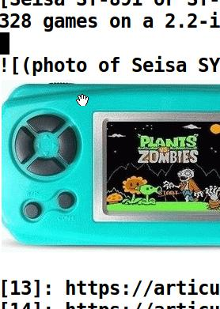
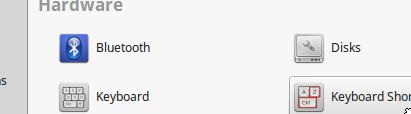
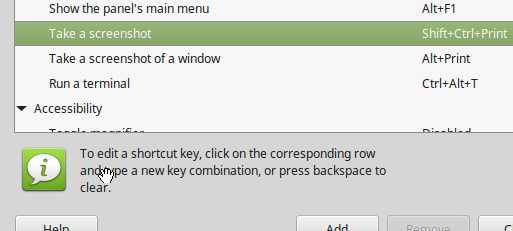
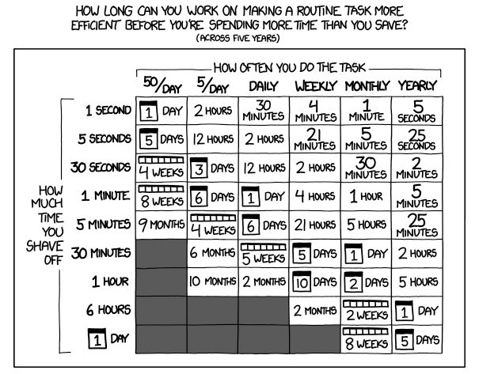
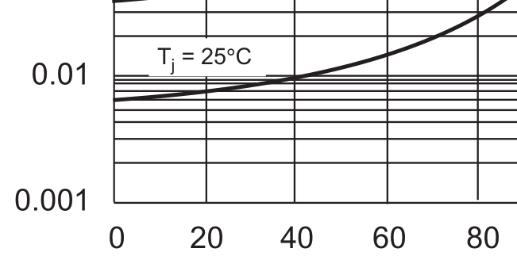

<!-- -*- lexical-binding: t -*- -->

I often take X-Windows screenshots to include in Derctuo, for example
the [schematic of My Very First Op-Amp](my-very-first-opamp.md).
Typically this process has looked something like:

1. Launch the GIMP.  Wait for it to finish booting.
2. Take a screenshot with it.
3. Crop the screenshot in the GIMP (shift-C), zooming in and out as
   necessary.
4. "Export" the screenshot (ctrl-E).
5. Exit the GIMP.
6. Confirm that, yes, I really do want to "exit without saving"
   (ctrl-D, I think).

This is very cumbersome, taking about a minute.  So I just tried some
various different screenshot programs to see what would work better.
KDE's "Spectacle" program is wonderful, better than I had thought
possible, and now I can invoke it from Emacs with a single keystroke
and automatically insert the resulting cropped screenshot into the
Markdown document I'm editing.

This has had the rather alarming effect of enabling me to add half a
megabyte of images to Derctuo over the last couple of days, which is
about the same as the amount of text I've added to it in the last two
*months*.  But the year 02020 is over in another month, and Derctuo is
still less than 10MB out of its 20MB size budget, so maybe I can
lighten up a bit.

Using KDE Spectacle from the command line
-----------------------------------------

Boudhayan Gupta's Spectacle is *the shit*.  It is *totally awesome*.

I ran `sudo apt install kde-spectacle` because I don't have KDE
installed.

`spectacle -rbo somedir/somefile.png` takes a few seconds to start,
and then brings up a fullscreen instruction screen, which you can
dismiss by starting to drag out a rectangle.  But *once the rectangle
is there*, you can *interactively resize it*, seeing the cropped image
as it will finally appear.  Then you can hit Enter to save it to
`somefile.png` (`-o`) with no further interaction (`-b`).  (Not even
confirmation for overwriting or errors for unsupported file
extensions — be careful!)

You can even use Spectacle to take a screenshot of Spectacle's own
cropping UI in operation; I think it works by taking a full-screen
screenshot when it starts, then covering up the screen with it for
this `-r` region cropping UI.  In fact, sometimes the cropping UI sort
of turns back time a little bit, showing what the screen looked like a
second or two earlier.

The whole interaction takes about 15 seconds, even though I'm not
running KDE.

This is the ideal mode of operation for invocation from a script; the
only GUI interaction is dragging out a box, optionally resizing it,
and pressing Enter or the right mouse button.

It has a few problems.  One is that it emits some debugging crap to
stderr every time you run it:

    Problem creating accessible interface for:  ScreenClipper(0x9aa3c90) 
    Make sure to deploy Qt with accessibility plugins.

Another problem is that if you cancel the screenshot, or if it fails,
you don't get a nonzero exit status; instead you just get another
stderr message:

    ERROR:  "Screenshot capture canceled or failed"

A third problem is that it somehow returns the keyboard focus to *the
XFCE desktop manager* every time it runs, so you normally have to
press alt-tab to get back to one of your windows.

At least four other reasonable options are not as good as Spectacle
-------------------------------------------------------------------

It turns out there are several other approaches that are considerably
more convenient than what I was doing with the GIMP.

`xfce4-screenshooter -s somedir -r` is nearly as good as Spectacle,
and it's even faster (maybe 6 seconds rather than 15 on this netbook),
but it doesn't let you interactively adjust the dotted-line crop box
shown above before saving — once you release the mouse button, that's
it!  But then it prompts you for a filename.  At least it has the
option of specifying what directory to put it in.

`mate-screenshot -a` is similar, but you have to manually navigate
through the filesystem to the right directory with its GUI.  Only the
first time you run it, though, or when you're switching directories.

`gnome-screenshot -i` is similar, except that you additionally have to
select the option to not screenshot the whole screen every fucking
time you fucking start it.

Mirage is an image viewer with a relatively accessible "crop" option
on its "Edit" menu, as well as a full-screen or full-window screenshot
option on its "File" menu; it's a much easier way to crop existing
images than the GIMP.  Beware, by default it saves the screenshots
into directories like `/tmp/mirage-EYotN0`.  The cropping
functionality is also somewhat suboptimal since the view of the image
in the cropping window is teensy (though what's shown on the left side
of the screenshot above is the thumbnails of other nearby files).
Having cropped the image you can
save it over the original with no further confirmation.

Several other options are even worse than the GIMP
--------------------------------------------------

KGrab takes forever and doesn't have a crop option.  ScreenGrab is
impossibly clumsy.  On this version of X11,
`xwd | xwdtopnm | pnmtopng > foo.png`
generates a totally bogus image that looks like it used the
wrong pixel format or the wrong part of the screen or something, and
of course it also doesn't have a crop option.  Kazam brings up a blank
gray fullscreen window so you can indicate which part of the screen
you want to grab; I think it's really intended for screencasting, with
screenshots being an afterthought.

The well-known `scrot` command is worth a mention; it doesn't have a crop
option, but `scrot -e 'mirage $f'` will open the full-screen
screenshot in Mirage so you can crop it with Mirage, and hopefully not
forget to save the cropped version.  By default `scrot` generates a
filename but you can instead specify one: `scrot foo.png`.

ImageMagick has an `import` command which I think can do
cropping — but I think you have to specify the pixel coordinates on
the command line, not with the mouse.

Scripting screenshotting in Elisp
---------------------------------

The workflow I really want is to be editing a Markdown document in
Emacs, press a magic key (Print Screen, which Emacs calls `<print>` or
`[print]`, actually works, since, for whatever reason, my XFCE doesn't
intercept it), type a filename to store the screenshot in, hide the
Emacs window, spawn off Spectacle to capture the file, unhide the
Emacs window, and insert a Markdown inline image tag for the
screenshot.

My Elisp is a little rusty, but I managed to get this to work:

    (defun screenshot-save-to (filename)
      "Interactively crop a screenshot with Spectacle and write to FILENAME.

      This is not an interactive command because it doesn't check
      to see if FILENAME already exists, doesn't hide and
      redisplay the Emacs window, and doesn't append .png if
      FILENAME isn't a PNG or JPEG filename.  `screenshot-make'
      does those things.

      "
      (let ((screenshot-return-value 'unknown-return-value))
        (let ((screenshot-messages
               (with-temp-buffer
                 (setq screenshot-return-value
                       (call-process "spectacle" nil t nil
                                     "-rbo" (expand-file-name filename)))
                 (buffer-string))))
          (if (or (string-match "ERROR" screenshot-messages)
                  (not (eq screenshot-return-value 0)))
              (error "Screenshot failed: %s(return value %s)"
                     screenshot-messages screenshot-return-value))

          (if (not (file-exists-p filename))
              (error "Screenshot supposedly succeeded but %s doesn't exist: %s"
                     filename screenshot-messages)))))

    (defmacro with-frame-iconified (&rest body)
      "Iconify the current frame only until BODY completes."
      (declare (indent 0) (debug t))

      `(progn
         (iconify-frame)
         (unwind-protect
             (progn ,@body)
           (make-frame-visible))))

    (defun screenshot-make (filename)
      "Take a cropped screenshot.

      If FILENAME doesn't end in .png or .jpeg, this command appends .png.
      When called as a Lisp function, it returns the real filename."
      (interactive "*FScreenshot filename to create: ")

      (if (not (or (string-suffix-p ".png" filename)
                   (string-suffix-p ".jpeg" filename)))
          (setq filename (concat filename ".png")))
      
      (if (file-exists-p filename)
          (if (not (yes-or-no-p (concat filename " already exists; overwrite? ")))
              (error (concat "Not overwriting " filename))))

      (with-frame-iconified
        (screenshot-save-to filename))

      (let ((file-size (elt (file-attributes filename) 7)))
        (message "Screenshot %s is %dKiB." filename (/ (+ 512 file-size) 1024)))

      filename)

    (defun screenshot-insert-preview-line (filename)
      "Insert a newline into the buffer with, if possible, the image FILENAME displayed."
      (interactive "*FImage filename: ")
      (let ((screenshot-image-descriptor
             (create-image (expand-file-name filename) nil nil :margin 4)))
        ;; (message "descriptor %s" screenshot-image-descriptor)
        (if screenshot-image-descriptor
            (progn
              ;; If we just overwrote an image, Emacs might have it
              ;; cached.
              (image-flush screenshot-image-descriptor)
              (insert-image screenshot-image-descriptor "\n"))
          (insert "\n"))))

    (defun markdown-insert-screenshot (filename)
      "Crop a screenshot and insert a Markdown inline image in source and buffer."
      (interactive "*FScreenshot filename to create: ")
      (setq filename (screenshot-make filename))

      (let ((basename (file-name-nondirectory filename)))
        (insert (format "\n\n" basename basename)))

      (screenshot-insert-preview-line filename))

    (defun markdown-insert-preview ()
       "Show a preview for the previous Markdown inline image tag if possible.

       Unfortunately this function modifies the buffer.
       "
        (interactive)
        (if (not (re-search-backward "^!\\[.*?\\](\\(.*\\))\n\n"))
            (message "no Markdown inline images found")
            (save-excursion
              (message "found %s" (match-string 1))
              (move-end-of-line 2)
              (delete-char 1)           ; hope this is a newline
              (screenshot-insert-preview-line (match-string 1)))))

     (global-set-key [print] 'markdown-insert-screenshot)
     (global-set-key [C-print] 'markdown-insert-preview)

This also displays the image inline in the Emacs buffer!  But only
until I close and reopen the file (or reboot Emacs), though I can
use Ctrl-PrtSc (`markdown-insert-preview`) to re-add them one by one
after reopening the file.
Mysteriously the `revert-buffer` command displays the images in the
right margin; I suspect this might be a bug in fill-column-indicator.el.
A little refactoring might make it
possible to scan for such images to add such previews to, but I
probably wouldn't want to invoke that automatically every time I
opened a file.

This is a pretty nice experience in Emacs as long as the images aren’t
too big:

(To make this work with the same key on MATE on my craptop, I opened
Main menu → Control Center → Hardware → Keyboard Shortcuts (*not*
“Keyboard”) → Desktop → Take a screenshot and reconfigured it to
“Shift+Ctrl+Print”.)

Sometimes the images seem to disappear and be replaced with small
squares; maybe Emacs is evicting them from some cache and not putting
them back.  So far this has been a minor annoyance.

Efficiency
----------

Well, I've spent the last 9 hours on automating screenshots†, so now I
can insert a screenshot into my notes in only 45 seconds.  I ran
through the previous procedure using the GIMP again and it took me 4
minutes and 51 seconds, but I think I was usually able to do it faster
than that — I must be getting sleepy, and I couldn't figure out where
the GIMP had saved my screenshot.  But, suppose it's 3 minutes
"saved".  Am I being efficient?

According to the comic, yes, as long as I insert several screenshots a
week, and keep doing this for five years or more; that seems very
likely to be true.  That doesn't take into account the good or bad of
having the screenshots displayed in the notes as I'm editing them,
though, or whether I learned anything useful in the process, or
whether these notes are useful to somebody else.

([Is It Worth The Time comic][0] by Randall Munroe, licensed CC-BY-NC
2.5.)

[0]: https://xkcd.com/1205/

† Actually, I spent some more time on it the next day to add JPEG
support and refactor the code reasonably.

Compression
-----------

By default if you ask Spectacle to write a JPEG it writes it with
reasonably high but not impeccable quality; in the case of the
XKCD comic above Spectacle generates about a 140K PNG (which
`pngcrush` reduces to 107K) or a 74K JPEG, while ImageMagick
produces an equivalent-quality JPEG with `convert -quality 50
xkcd-time-saved.png xkcd-time-saved.jpeg` at 50K, or an
equivalent-size JPEG with impeccable quality at `-quality
80` (73K, monochrome).

On theoretical grounds we would expect PNG to have a better
quality/compression tradeoff than JPEG on text and line art, and
that is somewhat borne out by experiment.  Consider this
Schottky-diode-leakage graph from [the note on diode
thermometers](diode-thermometer.md):

As a PNG this is 15K, which is pretty good.  It's still totally
readable at `-quality 1`, where it's 6K, and the JPEG artifacts
are not strikingly obvious at `-quality 10`, where it's 10K.  But
they don't really disappear until `-quality 50`, at which point
the JPEG is 18K.

The Mirage screenshot earlier looks pretty much the same in JPEG
with `-quality 80` and PNG, but it's 9K in JPEG and 17K in PNG.

I think the conclusion is that I should use JPEG for JPEG
things (and just accept Spectacle's reasonable default quality)
and use PNG for text and line art.  And occasionally I should run
`pngcrush` on all my PNGs, which is an easy batch process and
therefore doesn't need to be automated in the Elisp interaction
above.
