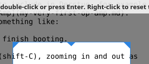
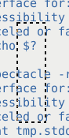

I often take X-Windows screenshots to include in Derctuo, for example
the [schematic of My Very First Op-Amp](my-very-first-op-amp.md).
Typically this process has looked something like:

1. Launch the GIMP.  Wait for it to finish booting.
2. Take a screenshot with it.
3. Crop the screenshot in the GIMP (shift-C), zooming in and out as
   necessary.
4. "Export" the screenshot (ctrl-E).
5. Exit the GIMP.
6. Confirm that, yes, I really do want to "exit without saving"
   (ctrl-D, I think).

This is very cumbersome, taking about a minute.  So I just tried some
various different screenshot programs to see what would work better.
KDE's "Spectacle" program is wonderful, better than I had thought
possible.

Using KDE Spectacle from the command line
-----------------------------------------

Boudhayan Gupta's Spectacle is *the shit*.  It is *totally awesome*.

I ran `sudo apt install kde-spectacle` because I don't have KDE
installed.

`spectacle -rbo somedir/somefile.png` takes a few seconds to start,
and then brings up a fullscreen instruction screen, which you can
dismiss by starting to drag out a rectangle.  But *once the rectangle
is there*, you can *interactively resize it*, seeing the cropped image
as it will finally appear.  Then you can hit Enter to save it to
`somefile.png` (`-o`) with no further interaction (`-b`).  (Not even
confirmation for overwriting or errors for unsupported file
extensions — be careful!)

You can even use Spectacle to take a screenshot of Spectacle's own
cropping UI in operation; I think it works by taking a full-screen
screenshot when it starts, then covering up the screen with it for
this `-r` region cropping UI.  In fact, sometimes the cropping UI sort
of turns back time a little bit, showing what the screen looked like a
second or two earlier.

The whole interaction takes about 15 seconds, even though I'm not
running KDE.

This is the ideal mode of operation for invocation from a script; the
only GUI interaction is dragging out a box, optionally resizing it,
and pressing Enter or the right mouse button.

It has a few problems.  One is that it emits some debugging crap to
stderr every time you run it:

    Problem creating accessible interface for:  ScreenClipper(0x9aa3c90) 
    Make sure to deploy Qt with accessibility plugins.

Another problem is that if you cancel the screenshot, or if it fails,
you don't get a nonzero exit status; instead you just get another
stderr message:

    ERROR:  "Screenshot capture canceled or failed"

A third problem is that it somehow returns the keyboard focus to *the
XFCE desktop manager* every time it runs, so you normally have to
press alt-tab to get back to one of your windows.

At least four other reasonable options are not as good as Spectacle
-------------------------------------------------------------------

It turns out there are several other approaches that are considerably
more convenient than what I was doing with the GIMP.

`xfce4-screenshooter -s somedir -r` is nearly as good as Spectacle,
and it's even faster (maybe 6 seconds rather than 15 on this netbook),
but it doesn't let you interactively adjust the dotted-line crop box
shown above before saving — once you release the mouse button, that's
it!  But then it prompts you for a filename.  At least it has the
option of specifying what directory to put it in.

`mate-screenshot -a` is similar, but you have to manually navigate
through the filesystem to the right directory with its GUI.  Only the
first time you run it, though, or when you're switching directories.

`gnome-screenshot -i` is similar, except that you additionally have to
select the option to not screenshot the whole screen every fucking
time you fucking start it.

Mirage is an image viewer with a relatively accessible "crop" option
on its "Edit" menu, as well as a full-screen or full-window screenshot
option on its "File" menu; it's a much easier way to crop existing
images than the GIMP.  Beware, by default it saves the screenshots
into directories like `/tmp/mirage-EYotN0`.  The cropping
functionality is also somewhat suboptimal since the view of the image
in the cropping window is teensy.  Having cropped the image you can
save it over the original with no further confirmation.

Several other options are even worse than the GIMP
--------------------------------------------------

KGrab takes forever and doesn't have a crop option.  ScreenGrab is
impossibly clumsy.  On this version of X11 `xwd | xwdtopnm | pnmtopng
> foo.png` generates a totally bogus image that looks like it used the
wrong pixel format or the wrong part of the screen or something, and
of course it also doesn't have a crop option.  Kazam brings up a blank
gray fullscreen window so you can indicate which part of the screen
you want to grab; I think it's really intended for screencasting, with
screenshots being an afterthought.  `scrot` doesn't have a crop
option, but `scrot -e 'mirage $f'` will open the full-screen
screenshot in Mirage so you can crop it with Mirage, and hopefully not
forget to save the cropped version.  By default `scrot` generates a
filename but you can instead specify one: `scrot foo.png`.

Scripting screenshotting in Elisp
---------------------------------

The workflow I really want is to be editing a Markdown document in
Emacs, press a magic key (Print Screen, which Emacs calls `<print>` or
`[print]`, actually works, since, for whatever reason, my XFCE doesn't
intercept it), type a filename to store the screenshot in, hide the
Emacs window, spawn off Spectacle to capture the file, unhide the
Emacs window, and insert a Markdown inline image tag for the
screenshot.

My Elisp is a little rusty, but I managed to get this to work:

    (defun markdown-insert-screenshot (filename)
      (interactive "*FScreenshot filename to create: ")
      (if (not (string-suffix-p ".png" filename))
          ;; XXX is setq really right for local vars?
          (setq filename (concat filename ".png")))
      
      (if (file-exists-p filename)
          (if (not (yes-or-no-p (concat filename " already exists; overwrite? ")))
              (error (concat "Not overwriting " filename))))

      (iconify-frame)
      (unwind-protect
          (let ((screenshot-return-value 'unknown-return-value))
            (let ((screenshot-messages
                   (with-temp-buffer      
                     (setq screenshot-return-value
                           (call-process "spectacle" nil t nil
                                         "-rbo" (expand-file-name filename)))
                     (buffer-string))))
              (if (or (string-match "ERROR" screenshot-messages)
                      (not (eq screenshot-return-value 0)))
                  (error (format "Screenshot failed: %s(return value %s)"
                                 screenshot-messages
                                 screenshot-return-value)))))
        (make-frame-visible))

      (let ((basename (file-name-nondirectory filename)))
        ;; XXX use concat?
        (insert (format "\n\n" basename basename)))
      (let ((screenshot-image-descriptor
             (create-image (expand-file-name filename) nil nil :margin 4)))
        ;;(message (format "descriptor %s" screenshot-image-descriptor))
        (if screenshot-image-descriptor
            (insert-image screenshot-image-descriptor "\n")
          (insert "\n"))))

     (global-set-key [print] 'markdown-insert-screenshot)
       
